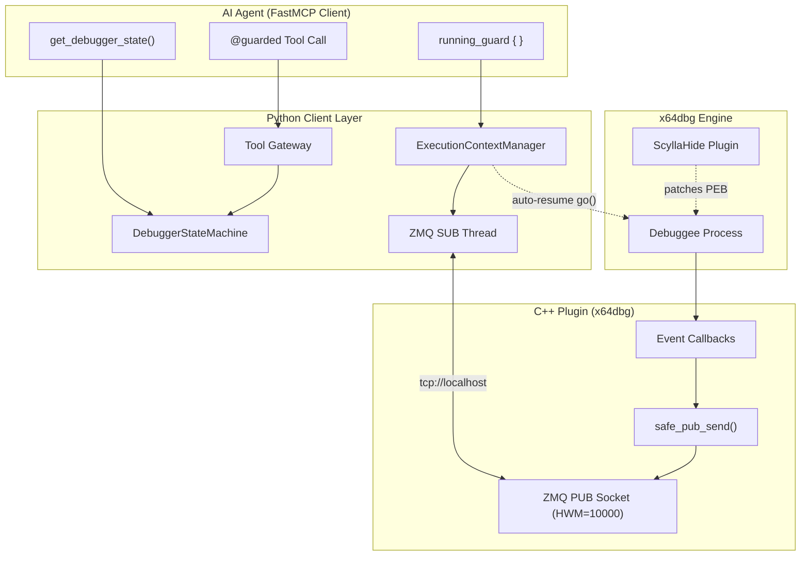
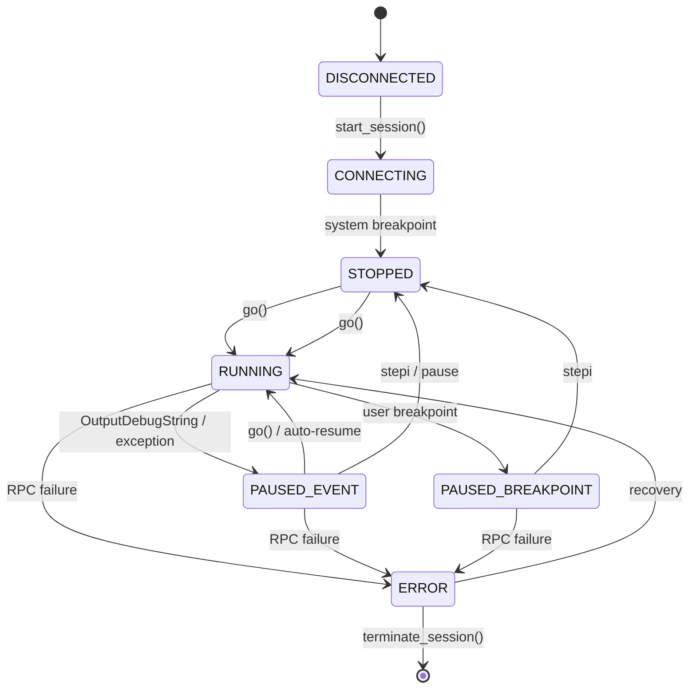
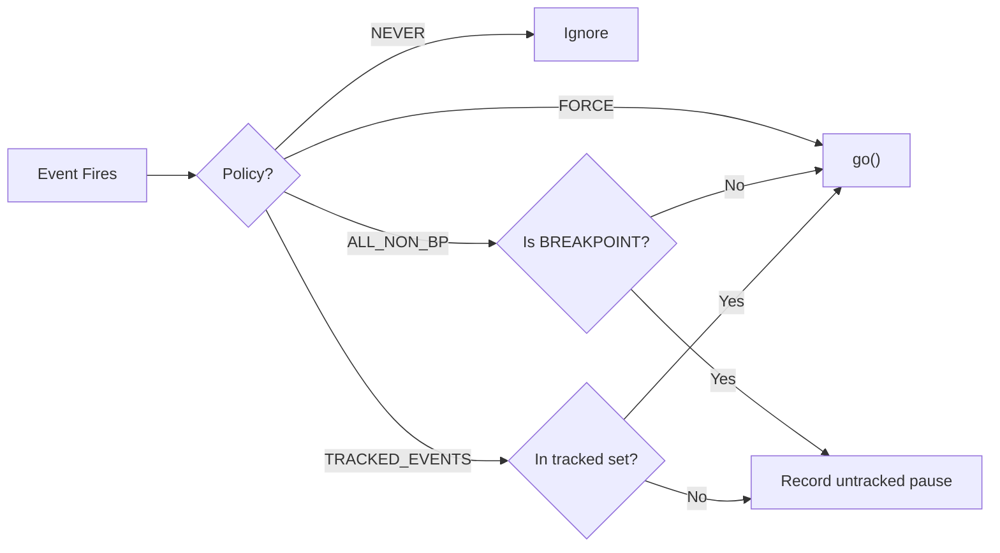
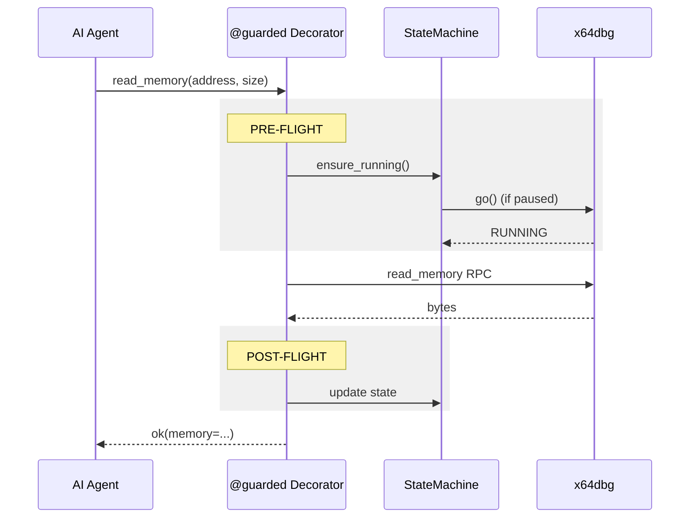

# Axon Execution Architecture
## Hardened Debugger Supervision for AI-Native Reverse Engineering

> **Version:** `Axon_MCP`  
> **Scope:** Python client + C++ plugin  
> **Goal:** Transform x64dbg from an unpredictable interactive debugger into a supervised, state-tracked execution engine that AI agents can query, monitor, and recover programmatically.

---

## Table of Contents

1. [The Problem](#1-the-problem)
2. [Design Principles](#2-design-principles)
3. [Architecture Overview](#3-architecture-overview)
4. [Debugger State Machine](#4-debugger-state-machine)
5. [Execution Context Manager](#5-execution-context-manager)
6. [Tool Gateway (`@guarded`)](#6-tool-gateway-guarded)
7. [Event Flow & ZMQ Hardening](#7-event-flow--zmq-hardening)
8. [Anti-Debug Plugin Mitigation](#8-anti-debug-plugin-mitigation)
9. [Infrastructure Tools](#9-infrastructure-tools)
10. [Agent Usage Patterns](#10-agent-usage-patterns)
11. [API Reference](#11-api-reference)
12. [Troubleshooting Matrix](#12-troubleshooting-matrix)

---

## 1. The Problem

x64dbg is an **interactive** debugger. When it catches an event (OutputDebugString, exception, DLL load, breakpoint), it **freezes all threads** in the debuggee. From the AI agent's perspective:

- `WaitForSingleObject(hThread, INFINITE)` → **hangs forever**
- `read_memory()` after `go()` → **might fail silently** if x64dbg paused mid-flight
- `OutputDebugStringA` with ScyllaHide → **no-op** because PEB.BeingDebugged is patched to 0
- Event arrives via ZMQ → **might be dropped** if subscriber buffer overflows

The original upstream test suite assumed a "clean" x64dbg without anti-debug plugins and human operators who manually click "Run" when the debugger pauses. AI agents cannot click buttons.

### Critical Edge Cases

| # | Edge Case | Root Cause | Impact |
|---|-----------|------------|--------|
| 1 | **Missed-Message Race** | Event published before monitor hook active | Lost event, timeout |
| 2 | **Cascading Event Deadlock** | Guard resumes on Event A, but Event B pauses immediately | Agent thinks process is running; actually frozen |
| 3 | **ZMQ Slow Joiner** | SUB socket not ready when PUB sends | Silent message loss |
| 4 | **ScyllaHide Reversion** | Anti-debug plugin re-patches PEB.BeingDebugged | `OutputDebugStringA` short-circuits |

---

## 2. Design Principles

1. **Explicit State over Implicit Hope** — Track x64dbg's state machine explicitly; never guess.
2. **Defensive Gateways over Blind Trust** — Every tool validates pre-conditions before acting.
3. **Finite Timeouts over Infinite Waits** — No operation blocks forever.
4. **Structured Errors over Silent Failures** — Every error includes a recovery hint.
5. **Fire-and-Forget Resumes over Blocking Callbacks** — ZMQ subscription thread never blocks on REQ socket.
6. **Non-Blocking PUB over Blocking Sends** — C++ plugin never stalls x64dbg's event loop.

---

## 3. Architecture Overview



---

## 4. Debugger State Machine

### States



### Transition Log

Every state change is recorded with:
- `timestamp` — Unix epoch
- `from_state`, `to_state` — previous and new state
- `reason` — human-readable cause
- `event_type` — if triggered by a debug event

```python
class DebuggerStateMachine:
    current_state: DebuggerState
    transition_log: list[StateTransition]
    
    def transition(self, new_state, reason="", event_type=None) -> StateTransition
    def is_healthy(self) -> bool           # False if ERROR or 3+ consecutive errors
    def is_executing(self) -> bool         # True if RUNNING
    def is_paused(self) -> bool            # True if STOPPED / PAUSED_EVENT / PAUSED_BREAKPOINT
    def get_recent_events(self, n=20) -> list[StateTransition]
```

**Health Monitor** (optional background thread):
- Polls `is_running()` / `is_debugging()` every 250ms
- Detects unexpected pauses when `expected_running=True`
- Fires `on_stall` callback if stalled longer than threshold

---

## 5. Execution Context Manager

### Resume Policies



### Nested Guards

```python
with client.running_guard({EVENT_OUTPUT_DEBUG_STRING}):
    # Guard A: tracks OUTPUT_DEBUG_STRING
    with client.running_guard({EVENT_LOAD_DLL}):
        # Guard B: tracks LOAD_DLL
        # Internally merges: {OUTPUT_DEBUG_STRING, LOAD_DLL}
        pass
    # Guard A restored automatically
```

### Implementation Notes

- `_auto_resume_fn` is set **before** `yield` — no spin-up race
- Fire-and-forget `go()` runs in a background `threading.Thread(daemon=True)`
- On exit, original hooks restored (or outer guard's handler rebound)
- Untracked pauses recorded in `GuardContext.untracked_pauses`
- Timeout raises `TimeoutError` with diagnostic payload

---

## 6. Tool Gateway (`@guarded`)

### Flow



### Error Recovery Hints

Every `err()` response includes a `hint` field:

```python
err(
    "Debugger is paused and could not be resumed.",
    ErrorType.TIMEOUT,
    hint="The debuggee may be stopped at a breakpoint or exception. "
         "Use 'get_debugger_state' to inspect, then 'go' or 'stepi' manually.",
)
```

### Read-Only Safety

When `X64DBG_MCP_READ_ONLY=1`:
- `@unsafe` tools are blocked at the gateway
- Returns `ErrorType.UNSAFE_OPERATION`
- Prevents accidental patches in read-only analysis workflows

---

## 7. Event Flow & ZMQ Hardening

### C++ Plugin: Non-Blocking PUB

```cpp
static void safe_pub_send(zmq::socket_t& sock, msgpack::sbuffer& buf) {
    try {
        auto result = sock.send(
            zmq::buffer(buf.data(), buf.size()),
            zmq::send_flags::dontwait   // ← never blocks x64dbg
        );
        if (!result.has_value()) {
            dprintf("[x64dbg-automate] PUB send would block\n");
        }
    } catch (const zmq::error_t& e) {
        if (e.num() == EAGAIN) {
            dprintf("[x64dbg-automate] PUB send dropped (EAGAIN)\n");
        }
    }
}
```

### Socket Configuration

```cpp
pub_socket = zmq::socket_t(context, zmq::socket_type::pub);
pub_socket.set(zmq::sockopt::sndhwm, 10000);  // ← high water mark
```

### Python SUB Thread

```python
def _sub_thread(self):
    while True:
        try:
            msg = msgpack.unpackb(self.sub_socket.recv(zmq.DONTWAIT))
            self.debug_event_publish(msg)
        except zmq.error.Again:
            time.sleep(0.2)  # ← poll interval
```

**Slow Joiner Mitigation:**
- SUB socket created once during `_init_connection()`
- Empty subscription filter (`b''`) — receives all events immediately
- Socket lives for entire session — no per-operation connects/disconnects

---

## 8. Anti-Debug Plugin Mitigation

### ScyllaHide Attack Surface

| Technique | ScyllaHide Action | Our Countermeasure |
|-----------|-------------------|-------------------|
| PEB.BeingDebugged | Patches to 0 | Shellcode restores to 1 before `OutputDebugStringA` |
| NtQueryInformationProcess | Hooks to return 0 | Test verified this profile doesn't hook it |
| Periodic re-patch | Background thread rewrites PEB | Single-shot shellcode wins the race |
| Hardware BP on PEB | Detects tampering | Not observed in current profile |

### Hardened Test Pattern

```python
# x64 shellcode:
mov rax, qword ptr gs:[0x60]   # Get PEB
mov byte ptr [rax+2], 1         # BeingDebugged = 1
mov rcx, sz_str                 # Arg: debug string
mov rax, OutputDebugStringA     # Function address
call rax                        # Fire event
ret
```

### Future Hardening (documented, not yet implemented)

For long-running payloads where ScyllaHide might re-patch:
- **Option A:** Re-apply PEB patch before every critical syscall
- **Option B:** Use direct `NtRaiseHardError` syscall instead of `OutputDebugStringA`
- **Option C:** Temporarily suspend ScyllaHide's background thread
- **Option D:** Kernel-level bypass via `NtDebugActiveProcess` manipulation

---

## 9. Infrastructure Tools

### `get_debugger_state`

Returns the current state machine snapshot:
```json
{
  "success": true,
  "state": "running",
  "is_healthy": true,
  "is_executing": true,
  "is_paused": false,
  "recent_transitions": [
    {"from": "stopped", "to": "running", "reason": "post_flight: running after tool"}
  ]
}
```

### `wait_for_stable_state`

Blocks until desired state is reached:
```python
wait_for_stable_state(desired_state="running", timeout=10.0)
```

### `force_resume`

Emergency hammer — retries `go()` up to 3 times:
```python
force_resume(pass_exceptions=False, swallow_exceptions=False)
```

### `get_execution_log`

Flight recorder for state transitions:
```python
get_execution_log(n=20)
```

---

## 10. Agent Usage Patterns

### Pattern A: Simple Guarded Operation

```python
with client.running_guard({EventType.EVENT_OUTPUT_DEBUG_STRING}):
    hThread = CreateRemoteThread(hProc, None, 0, shellcode, None, 0, None)
    WaitForSingleObject(hThread, 5000)
```

### Pattern B: Deep Inspection with State Validation

```python
# 1. Ensure we're in a known state
state = get_debugger_state()
if state["is_paused"]:
    force_resume()

# 2. Perform operation inside guard
with client.running_guard({EventType.EVENT_OUTPUT_DEBUG_STRING}):
    result = read_memory(address="0x401000", size=64)

# 3. Validate post-condition
post = get_debugger_state()
assert post["state"] == "running", f"Unexpected state: {post}"
```

### Pattern C: Multi-Step Workflow with Logging

```python
for step in workflow_steps:
    log = get_execution_log(n=5)
    print(f"Step {step.name}: recent events = {log['transitions']}")
    
    with client.running_guard(auto_resume_events=step.expected_events):
        step.execute(client)
    
    if not wait_for_stable_state(desired_state="running", timeout=5.0)["reached"]:
        raise RuntimeError(f"Step {step.name} failed to stabilize")
```

### Pattern D: Error Recovery Loop

```python
for attempt in range(3):
    try:
        with client.running_guard({EventType.EVENT_OUTPUT_DEBUG_STRING}):
            inject_and_run(shellcode)
        break
    except TimeoutError:
        state = get_debugger_state()
        if state["is_paused"]:
            force_resume()
        time.sleep(0.5)
```

---

## 11. API Reference

### Python Client Extensions

| Method | Signature | Description |
|--------|-----------|-------------|
| `ensure_running` | `(timeout: float = 1.0) -> bool` | Resume if paused |
| `running_guard` | `(auto_resume_events, timeout=5.0) -> GuardContext` | Context manager for guarded execution |
| `_axon_state_machine` | `DebuggerStateMachine` | Attached state machine instance |
| `_axon_exec_ctx` | `ExecutionContextManager` | Attached execution context manager |

### Decorators

| Decorator | Signature | Description |
|-----------|-----------|-------------|
| `@guarded` | `(pre_flight=True, post_flight=True, timeout=None, enforce_readonly=True)` | Tool gateway wrapper |
| `@timeout_retry` | `(timeout=10.0, retries=2, backoff_base=0.5)` | RPC resilience wrapper |

### MCP Tools

| Tool | Category | Description |
|------|----------|-------------|
| `get_debugger_state` | C15 Infrastructure | Current state snapshot |
| `wait_for_stable_state` | C15 Infrastructure | Block until state reached |
| `force_resume` | C15 Infrastructure | Emergency resume |
| `get_execution_log` | C15 Infrastructure | Transition flight recorder |
| `running_guard` | C15 Infrastructure | (Context manager, not direct tool) |

---

## 12. Troubleshooting Matrix

| Symptom | Likely Cause | Recovery Action |
|---------|--------------|-----------------|
| `queue.Empty` on event wait | ScyllaHide patched PEB | Use PEB-restoring shellcode |
| `WaitForSingleObject` hangs | x64dbg paused on event | Wrap in `running_guard` |
| `TIMEOUT` on tool call | Process stuck at breakpoint | `force_resume()` or `stepi()` |
| `NOT_CONNECTED` | Session terminated | `start_session()` or check sandbox |
| Event never arrives | ZMQ slow joiner | Ensure SUB connected before events flow |
| `OutputDebugStringA` no-op | NtQueryInformationProcess hooked | Use direct syscall alternative |
| `Circuit breaker OPEN` | 5+ consecutive RPC failures | Wait 10s or restart sandbox |
| State = `ERROR` | RPC exception | `get_execution_log()` to diagnose |

---

## Files Changed

| File | Change |
|------|--------|
| `x64dbg_automate/api_runtime/debugger_state.py` | **NEW** — State machine + health monitor |
| `x64dbg_automate/api_runtime/execution_context.py` | **NEW** — Hardened `running_guard` v2 |
| `x64dbg_automate/api_runtime/tool_gateway.py` | **NEW** — `@guarded` decorator |
| `x64dbg_automate/api_runtime/timeout_retry.py` | **NEW** — Timeout + circuit breaker |
| `x64dbg_automate/api_runtime/api_infrastructure.py` | **NEW** — 4 MCP infrastructure tools |
| `x64dbg_automate/__init__.py` | Attach `_axon_state_machine` + `_axon_exec_ctx` to `X64DbgClient` |
| `x64dbg_automate/events.py` | Add `_auto_resume_events` + `_auto_resume_fn` hooks |
| `x64dbg_automate/api_runtime/__init__.py` | Import `api_infrastructure` |
| `x64dbg-automate-plus/src/plugin.cpp` | `safe_pub_send()` + `zmq::send_flags::dontwait` |
| `x64dbg-automate-plus/src/xauto_server.cpp` | `ZMQ_SNDHWM = 10000` on PUB socket |
| `tests/test_api_runtime.py` | Add `TestRunningGuard` (5 tests) + `TestInfrastructureTools` (9 tests) |
| `tests/test_hla_commands.py` | PEB patch + null terminator + `running_guard` wrapper |

---

## Compatibility

- **Python:** 3.13+
- **Capstone:** 5.0.6
- **ZeroMQ:** 4.3+ (cppzmq)
- **x64dbg:** Any build with `x64dbg-automate` plugin installed
- **Compat Version:** `"Axon_MCP"`

---

*This architecture was designed to eliminate the class of bugs where AI agents lose synchronization with the debugger's execution state. No operation blocks forever; no event is silently dropped; no anti-debug plugin can hide the debugger's presence from the agent's instrumentation.*
